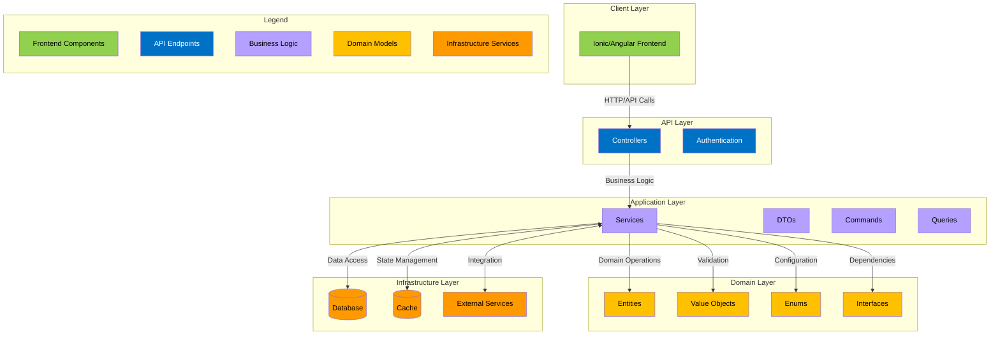
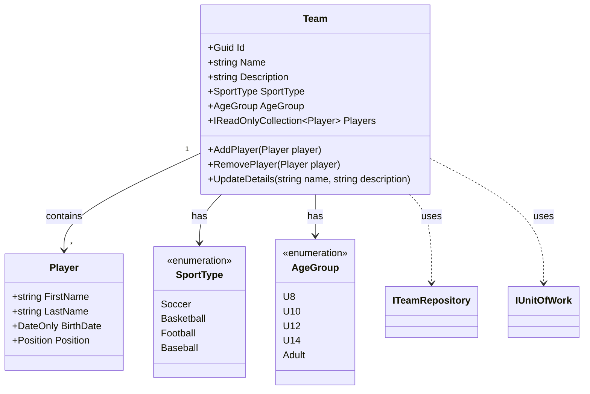
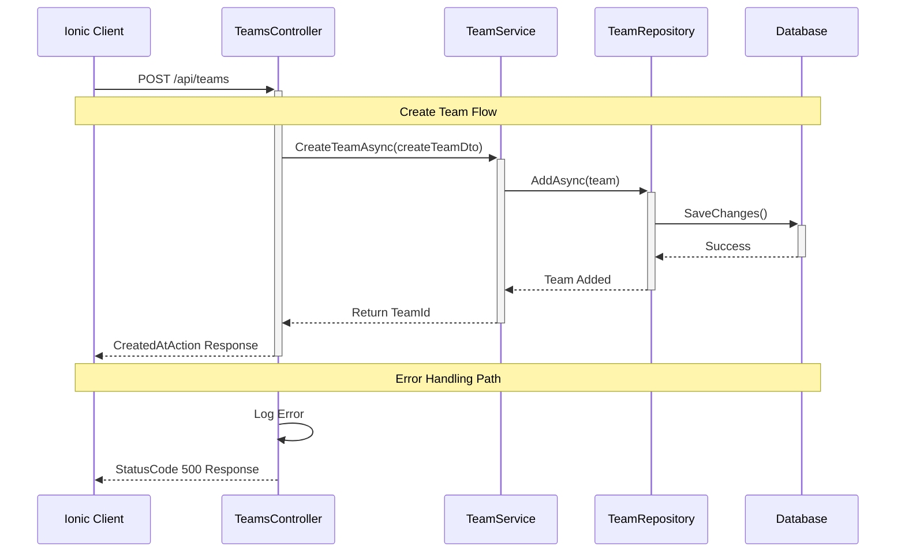
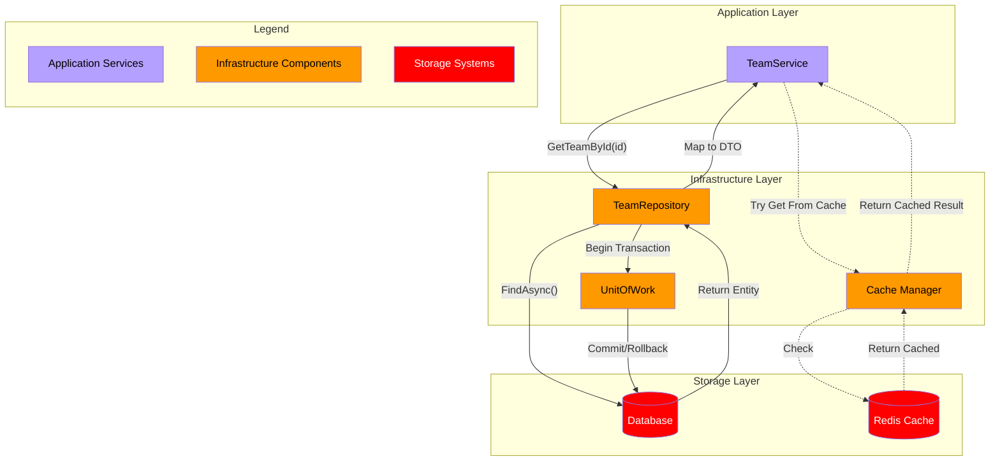

# Comprehensive Guide to Building a Sprocket Sports Mobile App
Let's enhance this comprehensive guide with strategic technical flow diagrams to illustrate the architecture and component relationships.

### Architecture Overview

The Sprocket Sports Mobile application follows Clean Architecture principles, with a layered approach that separates concerns and promotes maintainability. Here's the high-level architectural overview:



The diagram above illustrates the layered architecture of the Sprocket Sports Mobile application. Each layer is color-coded to represent different concerns:

- Green represents client-facing components
- Blue shows API endpoints and authentication
- Purple indicates business logic and application services
- Yellow represents domain models and core business rules
- Orange highlights infrastructure services

Notice how dependencies flow inward, with outer layers depending on inner ones, never the reverse. This ensures that business rules remain independent of infrastructure concerns.

### Domain Layer Relationships

Let's examine how entities relate within the domain layer:



The class diagram above shows the relationships between domain entities using UML notation:

- Solid arrows (-->) indicate composition relationships (Team contains Players)
- Dotted arrows (..>) show dependencies (Team uses repositories)
- The "1" to "*" notation indicates that one Team can have many Players
- <<enumeration>> indicates fixed sets of values (SportType and AgeGroup)

### Team Creation Flow

Let's examine how team creation flows through different layers of the application:



The sequence diagram above illustrates the flow of creating a team, where:

- Solid arrows (->>) represent method calls or requests
- Dashed arrows (-->>) show responses or returns
- Vertical bars show when each component is active
- "CreatedAtAction" creates a response with the location URL for the newly created resource
- Error handling follows a separate path with logging before returning to the client

### Infrastructure Layer Interactions

Finally, let's look at how the infrastructure layer handles database operations:



This infrastructure diagram shows three key flows:

- Solid arrows (->) represent direct method calls and data flow
- Dotted lines (-.->) indicate optional or cached operations
- The color scheme follows our architecture layers:
  - Purple represents application services
  - Orange shows infrastructure components
  - Red indicates storage systems


The UnitOfWork pattern coordinates database transactions across multiple repositories, ensuring atomic operations when dealing with related entities. The Cache Manager provides a layer of caching using Redis, reducing database load for frequently accessed data.

These diagrams collectively illustrate how the Clean Architecture principles are implemented in the Sprocket Sports Mobile application, from client requests through to database persistence, with clear separation of concerns and well-defined interfaces between layers.


This guide will walk you through creating a robust, maintainable, and scalable mobile application for Sprocket Sports using modern software engineering principles and best practices.

## Project Setup and Directory Structure

The directory structure follows Domain-Driven Design (DDD) principles, separating concerns and organizing code by business domains rather than technical layers.

### Creating the Base Project Structure

First, let's create a script that establishes our directory structure following clean architecture principles:

```powershell
# Create the base project directory
New-Item -ItemType Directory -Path "SprocketSportsMobile" -Force
Set-Location -Path "SprocketSportsMobile"

# Create solution file
dotnet new sln --name SprocketSportsMobile

# Create core domain project (heart of the application)
dotnet new classlib -o "src/SprocketSportsMobile.Domain"
dotnet sln add "src/SprocketSportsMobile.Domain"

# Create application layer (business logic)
dotnet new classlib -o "src/SprocketSportsMobile.Application"
dotnet sln add "src/SprocketSportsMobile.Application"

# Create infrastructure layer (external concerns)
dotnet new classlib -o "src/SprocketSportsMobile.Infrastructure"
dotnet sln add "src/SprocketSportsMobile.Infrastructure"

# Create API project
dotnet new webapi -o "src/SprocketSportsMobile.Api"
dotnet sln add "src/SprocketSportsMobile.Api"

# Create Ionic/Angular frontend project
mkdir "src/SprocketSportsMobile.Client"

# Create test projects
dotnet new xunit -o "tests/SprocketSportsMobile.Domain.Tests"
dotnet sln add "tests/SprocketSportsMobile.Domain.Tests"

dotnet new xunit -o "tests/SprocketSportsMobile.Application.Tests"
dotnet sln add "tests/SprocketSportsMobile.Application.Tests"

dotnet new xunit -o "tests/SprocketSportsMobile.Infrastructure.Tests"
dotnet sln add "tests/SprocketSportsMobile.Infrastructure.Tests"

dotnet new xunit -o "tests/SprocketSportsMobile.Api.Tests"
dotnet sln add "tests/SprocketSportsMobile.Api.Tests"

# Create Docker and configuration directories
mkdir "docker"
mkdir "config"
```

### Why This Structure?

This structure implements Clean Architecture principles, separating the application into concentric layers:

1. **Domain Layer**: Contains business entities, value objects, and domain logic
2. **Application Layer**: Contains business use cases, commands, and queries
3. **Infrastructure Layer**: Contains external concerns like databases, file systems, and external APIs
4. **API Layer**: Exposes the application to the outside world
5. **Client Layer**: The Ionic/Angular frontend application

This separation enforces the Dependency Inversion Principle (the 'D' in SOLID), ensuring that inner layers don't depend on outer layers.

## Setting Up the Domain Layer

Let's create the core domain entities and value objects:

```powershell
Set-Location -Path "src/SprocketSportsMobile.Domain"

# Create domain entities
mkdir -Path "Entities"
mkdir -Path "ValueObjects"
mkdir -Path "Enums"
mkdir -Path "Exceptions"
mkdir -Path "Interfaces"
```

Now, let's create a sample domain entity:

```csharp
// src/SprocketSportsMobile.Domain/Entities/Team.cs
using System;
using System.Collections.Generic;
using SprocketSportsMobile.Domain.Enums;
using SprocketSportsMobile.Domain.ValueObjects;

namespace SprocketSportsMobile.Domain.Entities
{
    public class Team
    {
        private readonly List _players = new();
        
        public Guid Id { get; private set; }
        public string Name { get; private set; }
        public string Description { get; private set; }
        public SportType SportType { get; private set; }
        public AgeGroup AgeGroup { get; private set; }
        public IReadOnlyCollection Players => _players.AsReadOnly();
        
        private Team() { } // For ORM
        
        public Team(string name, string description, SportType sportType, AgeGroup ageGroup)
        {
            Id = Guid.NewGuid();
            Name = name ?? throw new ArgumentNullException(nameof(name));
            Description = description;
            SportType = sportType;
            AgeGroup = ageGroup;
        }
        
        public void AddPlayer(Player player)
        {
            if (player == null) throw new ArgumentNullException(nameof(player));
            _players.Add(player);
        }
        
        public void RemovePlayer(Player player)
        {
            if (player == null) throw new ArgumentNullException(nameof(player));
            _players.Remove(player);
        }
        
        public void UpdateDetails(string name, string description)
        {
            Name = name ?? throw new ArgumentNullException(nameof(name));
            Description = description;
        }
    }
}
```

## Setting Up the Application Layer

The application layer contains use cases and business logic:

```powershell
Set-Location -Path "src/SprocketSportsMobile.Application"

# Create application service directories
mkdir -Path "Services"
mkdir -Path "Interfaces"
mkdir -Path "DTOs"
mkdir -Path "Commands"
mkdir -Path "Queries"
mkdir -Path "Validators"
mkdir -Path "Behaviors"
mkdir -Path "Exceptions"
```

Let's create a sample application service:

```csharp
// src/SprocketSportsMobile.Application/Services/TeamService.cs
using System;
using System.Collections.Generic;
using System.Threading.Tasks;
using SprocketSportsMobile.Application.DTOs;
using SprocketSportsMobile.Application.Interfaces;
using SprocketSportsMobile.Domain.Entities;
using SprocketSportsMobile.Domain.Interfaces;

namespace SprocketSportsMobile.Application.Services
{
    public class TeamService : ITeamService
    {
        private readonly ITeamRepository _teamRepository;
        private readonly IUnitOfWork _unitOfWork;
        
        public TeamService(ITeamRepository teamRepository, IUnitOfWork unitOfWork)
        {
            _teamRepository = teamRepository ?? throw new ArgumentNullException(nameof(teamRepository));
            _unitOfWork = unitOfWork ?? throw new ArgumentNullException(nameof(unitOfWork));
        }
        
        public async Task GetTeamByIdAsync(Guid id)
        {
            var team = await _teamRepository.GetByIdAsync(id);
            if (team == null) return null;
            
            return new TeamDto
            {
                Id = team.Id,
                Name = team.Name,
                Description = team.Description,
                SportType = team.SportType.ToString(),
                AgeGroup = team.AgeGroup.ToString(),
                PlayerCount = team.Players.Count
            };
        }
        
        public async Task> GetAllTeamsAsync()
        {
            var teams = await _teamRepository.GetAllAsync();
            var teamDtos = new List();
            
            foreach (var team in teams)
            {
                teamDtos.Add(new TeamDto
                {
                    Id = team.Id,
                    Name = team.Name,
                    Description = team.Description,
                    SportType = team.SportType.ToString(),
                    AgeGroup = team.AgeGroup.ToString(),
                    PlayerCount = team.Players.Count
                });
            }
            
            return teamDtos;
        }
        
        public async Task CreateTeamAsync(CreateTeamDto createTeamDto)
        {
            var team = new Team(
                createTeamDto.Name,
                createTeamDto.Description,
                createTeamDto.SportType,
                createTeamDto.AgeGroup
            );
            
            await _teamRepository.AddAsync(team);
            await _unitOfWork.SaveChangesAsync();
            
            return team.Id;
        }
    }
}
```

## Setting Up the Infrastructure Layer

The infrastructure layer handles external concerns:

```powershell
Set-Location -Path "src/SprocketSportsMobile.Infrastructure"

# Create infrastructure directories
mkdir -Path "Persistence"
mkdir -Path "Persistence/Configurations"
mkdir -Path "Persistence/Repositories"
mkdir -Path "Persistence/Migrations"
mkdir -Path "Services"
mkdir -Path "Logging"
mkdir -Path "Identity"
mkdir -Path "DependencyInjection"
```

Let's create a sample repository implementation:

```csharp
// src/SprocketSportsMobile.Infrastructure/Persistence/Repositories/TeamRepository.cs
using System;
using System.Collections.Generic;
using System.Linq;
using System.Threading.Tasks;
using Microsoft.EntityFrameworkCore;
using SprocketSportsMobile.Domain.Entities;
using SprocketSportsMobile.Domain.Interfaces;
using SprocketSportsMobile.Infrastructure.Persistence;

namespace SprocketSportsMobile.Infrastructure.Persistence.Repositories
{
    public class TeamRepository : ITeamRepository
    {
        private readonly ApplicationDbContext _context;
        
        public TeamRepository(ApplicationDbContext context)
        {
            _context = context ?? throw new ArgumentNullException(nameof(context));
        }
        
        public async Task GetByIdAsync(Guid id)
        {
            return await _context.Teams
                .Include(t => t.Players)
                .FirstOrDefaultAsync(t => t.Id == id);
        }
        
        public async Task> GetAllAsync()
        {
            return await _context.Teams
                .Include(t => t.Players)
                .ToListAsync();
        }
        
        public async Task AddAsync(Team team)
        {
            await _context.Teams.AddAsync(team);
        }
        
        public void Update(Team team)
        {
            _context.Teams.Update(team);
        }
        
        public void Delete(Team team)
        {
            _context.Teams.Remove(team);
        }
    }
}
```

## Setting Up the API Layer

The API layer exposes our application to the outside world:

```powershell
Set-Location -Path "src/SprocketSportsMobile.Api"

# Create API directories
mkdir -Path "Controllers"
mkdir -Path "Filters"
mkdir -Path "Middleware"
mkdir -Path "Extensions"
```

Let's create a sample controller:

```csharp
// src/SprocketSportsMobile.Api/Controllers/TeamsController.cs
using System;
using System.Collections.Generic;
using System.Threading.Tasks;
using Microsoft.AspNetCore.Authorization;
using Microsoft.AspNetCore.Mvc;
using Microsoft.Extensions.Logging;
using SprocketSportsMobile.Application.DTOs;
using SprocketSportsMobile.Application.Interfaces;

namespace SprocketSportsMobile.Api.Controllers
{
    [ApiController]
    [Route("api/[controller]")]
    [Authorize]
    public class TeamsController : ControllerBase
    {
        private readonly ITeamService _teamService;
        private readonly ILogger _logger;
        
        public TeamsController(ITeamService teamService, ILogger logger)
        {
            _teamService = teamService ?? throw new ArgumentNullException(nameof(teamService));
            _logger = logger ?? throw new ArgumentNullException(nameof(logger));
        }
        
        [HttpGet]
        public async Task>> GetAllTeams()
        {
            try
            {
                var teams = await _teamService.GetAllTeamsAsync();
                return Ok(teams);
            }
            catch (Exception ex)
            {
                _logger.LogError(ex, "Error retrieving all teams");
                return StatusCode(500, "An error occurred while retrieving teams");
            }
        }
        
        [HttpGet("{id}")]
        public async Task> GetTeamById(Guid id)
        {
            try
            {
                var team = await _teamService.GetTeamByIdAsync(id);
                if (team == null) return NotFound();
                return Ok(team);
            }
            catch (Exception ex)
            {
                _logger.LogError(ex, "Error retrieving team with ID {TeamId}", id);
                return StatusCode(500, "An error occurred while retrieving the team");
            }
        }
        
        [HttpPost]
        public async Task> CreateTeam(CreateTeamDto createTeamDto)
        {
            try
            {
                var teamId = await _teamService.CreateTeamAsync(createTeamDto);
                return CreatedAtAction(nameof(GetTeamById), new { id = teamId }, teamId);
            }
            catch (Exception ex)
            {
                _logger.LogError(ex, "Error creating team");
                return StatusCode(500, "An error occurred while creating the team");
            }
        }
    }
}
```

## Setting Up the Ionic Client

Now, let's set up the Ionic client:

```powershell
Set-Location -Path "src"
# Initialize a new Ionic Angular project
ionic start SprocketSportsMobile.Client tabs --type=angular
Set-Location -Path "SprocketSportsMobile.Client"

# Install necessary dependencies
npm install @ionic/storage-angular @auth0/angular-jwt
```

Let's create a sample service in the Ionic client:

```typescript
// src/SprocketSportsMobile.Client/src/app/services/team.service.ts
import { Injectable } from '@angular/core';
import { HttpClient } from '@angular/common/http';
import { Observable } from 'rxjs';
import { environment } from '../../environments/environment';

@Injectable({
  providedIn: 'root'
})
export class TeamService {
  private apiUrl = `${environment.apiUrl}/api/teams`;

  constructor(private http: HttpClient) { }

  getAllTeams(): Observable {
    return this.http.get(this.apiUrl);
  }

  getTeamById(id: string): Observable {
    return this.http.get(`${this.apiUrl}/${id}`);
  }

  createTeam(team: any): Observable {
    return this.http.post(this.apiUrl, team);
  }
}
```

## Unit Testing

Let's create comprehensive unit tests:

```powershell
Set-Location -Path "tests/SprocketSportsMobile.Domain.Tests"

# Create test directories
mkdir -Path "Entities"
```

Sample unit test for the Team entity:

```csharp
// tests/SprocketSportsMobile.Domain.Tests/Entities/TeamTests.cs
using System;
using SprocketSportsMobile.Domain.Entities;
using SprocketSportsMobile.Domain.Enums;
using SprocketSportsMobile.Domain.ValueObjects;
using Xunit;

namespace SprocketSportsMobile.Domain.Tests.Entities
{
    public class TeamTests
    {
        [Fact]
        public void CreateTeam_WithValidParameters_ShouldCreateTeam()
        {
            // Arrange
            string name = "U12 Boys Blue";
            string description = "Under 12 Boys Blue Team";
            SportType sportType = SportType.Soccer;
            AgeGroup ageGroup = AgeGroup.U12;
            
            // Act
            var team = new Team(name, description, sportType, ageGroup);
            
            // Assert
            Assert.NotEqual(Guid.Empty, team.Id);
            Assert.Equal(name, team.Name);
            Assert.Equal(description, team.Description);
            Assert.Equal(sportType, team.SportType);
            Assert.Equal(ageGroup, team.AgeGroup);
            Assert.Empty(team.Players);
        }
        
        [Fact]
        public void CreateTeam_WithNullName_ShouldThrowArgumentNullException()
        {
            // Arrange
            string name = null;
            string description = "Under 12 Boys Blue Team";
            SportType sportType = SportType.Soccer;
            AgeGroup ageGroup = AgeGroup.U12;
            
            // Act & Assert
            Assert.Throws(() => new Team(name, description, sportType, ageGroup));
        }
        
        [Fact]
        public void AddPlayer_WithValidPlayer_ShouldAddPlayerToTeam()
        {
            // Arrange
            var team = new Team("U12 Boys Blue", "Under 12 Boys Blue Team", SportType.Soccer, AgeGroup.U12);
            var player = new Player("John", "Doe", new DateOnly(2010, 1, 1), Position.Forward);
            
            // Act
            team.AddPlayer(player);
            
            // Assert
            Assert.Single(team.Players);
            Assert.Contains(player, team.Players);
        }
        
        [Fact]
        public void AddPlayer_WithNullPlayer_ShouldThrowArgumentNullException()
        {
            // Arrange
            var team = new Team("U12 Boys Blue", "Under 12 Boys Blue Team", SportType.Soccer, AgeGroup.U12);
            Player player = null;
            
            // Act & Assert
            Assert.Throws(() => team.AddPlayer(player));
        }
    }
}
```

## Docker Configuration

Let's create Docker configuration files:

```powershell
Set-Location -Path "SprocketSportsMobile"

# Create Docker files
New-Item -ItemType File -Path "docker/Dockerfile.api" -Force
New-Item -ItemType File -Path "docker/Dockerfile.client" -Force
New-Item -ItemType File -Path "docker-compose.yml" -Force
```

API Dockerfile:

```dockerfile
# docker/Dockerfile.api
FROM mcr.microsoft.com/dotnet/aspnet:8.0 AS base
WORKDIR /app
EXPOSE 80
EXPOSE 443

FROM mcr.microsoft.com/dotnet/sdk:8.0 AS build
WORKDIR /src
COPY ["src/SprocketSportsMobile.Api/SprocketSportsMobile.Api.csproj", "src/SprocketSportsMobile.Api/"]
COPY ["src/SprocketSportsMobile.Application/SprocketSportsMobile.Application.csproj", "src/SprocketSportsMobile.Application/"]
COPY ["src/SprocketSportsMobile.Domain/SprocketSportsMobile.Domain.csproj", "src/SprocketSportsMobile.Domain/"]
COPY ["src/SprocketSportsMobile.Infrastructure/SprocketSportsMobile.Infrastructure.csproj", "src/SprocketSportsMobile.Infrastructure/"]
RUN dotnet restore "src/SprocketSportsMobile.Api/SprocketSportsMobile.Api.csproj"
COPY . .
WORKDIR "/src/src/SprocketSportsMobile.Api"
RUN dotnet build "SprocketSportsMobile.Api.csproj" -c Release -o /app/build

FROM build AS publish
RUN dotnet publish "SprocketSportsMobile.Api.csproj" -c Release -o /app/publish

FROM base AS final
WORKDIR /app
COPY --from=publish /app/publish .
ENTRYPOINT ["dotnet", "SprocketSportsMobile.Api.dll"]
```

Client Dockerfile:

```dockerfile
# docker/Dockerfile.client
FROM node:18-alpine AS build
WORKDIR /app

---
Answer from Perplexity: pplx.ai/share
